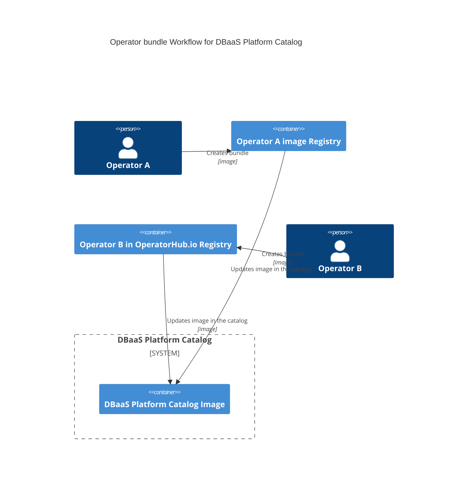
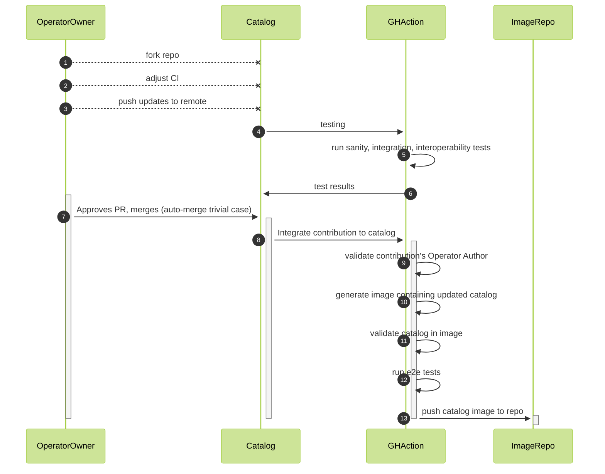
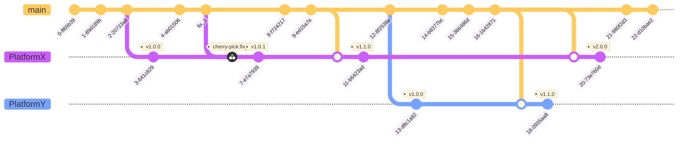

# DBaaS Platform OLM Catalog

<!-- toc -->
- [DBaaS Platform OLM Catalog](#dbaas-platform-olm-catalog)
  - [Summary](#summary)
  - [Motivation](#motivation)
    - [Goals](#goals)
    - [Non-Goals](#non-goals)
  - [Proposal](#proposal)
    - [User Stories (Optional)](#user-stories-optional)
      - [Story 1](#story-1)
      - [Story 2](#story-2)
    - [Notes/Constraints/Caveats (Optional)](#notesconstraintscaveats-optional)
    - [Risks and Mitigations](#risks-and-mitigations)
  - [Design Details](#design-details)
    - [Adding/Updating operator bundle](#addingupdating-operator-bundle)
    - [Creating new platform](#creating-new-platform)
    - [Git branching](#git-branching)
    - [Catalog images](#catalog-images)
    - [Candidate Channel](#candidate-channel)
    - [Using Catalog](#using-catalog)
    - [Test Plan](#test-plan)
        - [Unit tests](#unit-tests)
        - [Integration tests](#integration-tests)
        - [e2e tests](#e2e-tests)
    - [Upgrade / Downgrade Strategy](#upgrade--downgrade-strategy)
    - [Version Skew Strategy](#version-skew-strategy)
  - [Production Readiness Review Questionnaire](#production-readiness-review-questionnaire)
    - [Feature Enablement and Rollback](#feature-enablement-and-rollback)
          - [How can this feature be enabled / disabled in a live cluster?](#how-can-this-feature-be-enabled--disabled-in-a-live-cluster)
          - [Does enabling the feature change any default behavior?](#does-enabling-the-feature-change-any-default-behavior)
          - [Can the feature be disabled once it has been enabled (i.e. can we roll back the enablement)?](#can-the-feature-be-disabled-once-it-has-been-enabled-ie-can-we-roll-back-the-enablement)
          - [What happens if we reenable the feature if it was previously rolled back?](#what-happens-if-we-reenable-the-feature-if-it-was-previously-rolled-back)
          - [Are there any tests for feature enablement/disablement?](#are-there-any-tests-for-feature-enablementdisablement)
    - [Rollout, Upgrade and Rollback Planning](#rollout-upgrade-and-rollback-planning)
    - [Monitoring Requirements](#monitoring-requirements)
    - [Dependencies](#dependencies)
          - [Does this feature depend on any specific services running in the cluster?](#does-this-feature-depend-on-any-specific-services-running-in-the-cluster)
    - [Scalability](#scalability)
          - [Will enabling / using this feature result in any new API calls?](#will-enabling--using-this-feature-result-in-any-new-api-calls)
          - [Will enabling / using this feature result in introducing new API types?](#will-enabling--using-this-feature-result-in-introducing-new-api-types)
          - [Will enabling / using this feature result in any new calls to the cloud provider?](#will-enabling--using-this-feature-result-in-any-new-calls-to-the-cloud-provider)
          - [Will enabling / using this feature result in increasing size or count of the existing API objects?](#will-enabling--using-this-feature-result-in-increasing-size-or-count-of-the-existing-api-objects)
          - [Will enabling / using this feature result in increasing time taken by any operations covered by existing SLIs/SLOs?](#will-enabling--using-this-feature-result-in-increasing-time-taken-by-any-operations-covered-by-existing-slisslos)
          - [Will enabling / using this feature result in non-negligible increase of resource usage (CPU, RAM, disk, IO, ...) in any components?](#will-enabling--using-this-feature-result-in-non-negligible-increase-of-resource-usage-cpu-ram-disk-io--in-any-components)
    - [Troubleshooting](#troubleshooting)
          - [What are other known failure modes?](#what-are-other-known-failure-modes)
  - [Implementation History](#implementation-history)
  - [Drawbacks](#drawbacks)
  - [Alternatives](#alternatives)
  - [Infrastructure Needed (Optional)](#infrastructure-needed-optional)
<!-- /toc -->

## Summary

<!--
This section is incredibly important for producing high-quality, user-focused
documentation such as release notes or a development roadmap. It should be
possible to collect this information before implementation begins, in order to
avoid requiring implementors to split their attention between writing release
notes and implementing the feature itself. KEP editors and SIG Docs
should help to ensure that the tone and content of the `Summary` section is
useful for a wide audience.

A good summary is probably at least a paragraph in length.

Both in this section and below, follow the guidelines of the [documentation
style guide]. In particular, wrap lines to a reasonable length, to make it
easier for reviewers to cite specific portions, and to minimize diff churn on
updates.

[documentation style guide]: https://github.com/kubernetes/community/blob/master/contributors/guide/style-guide.md
-->

DBaaS Platform OLM Catalog would provide set of operators to extend Kubernetes to deliver DBaaS Platform based on it.

## Motivation

<!--
This section is for explicitly listing the motivation, goals, and non-goals of
this KEP.  Describe why the change is important and the benefits to users. The
motivation section can optionally provide links to [experience reports] to
demonstrate the interest in a KEP within the wider Kubernetes community.

[experience reports]: https://github.com/golang/go/wiki/ExperienceReports
-->

### Goals

<!--
List the specific goals of the KEP. What is it trying to achieve? How will we
know that this has succeeded?
-->

Create and Maintain OLM DBaaS Platform Catalog to provide instrumentation (catalog of operators) to build DBaaS Platform on Kubernetes base. Enable community to develop and extend this catalog.

### Non-Goals

<!--
What is out of scope for this KEP? Listing non-goals helps to focus discussion
and make progress.
-->

Developing operators, creating/developing/maintaining operator bundles.

Creating/Developing DBaaS Platform.

## Proposal

<!--
This is where we get down to the specifics of what the proposal actually is.
This should have enough detail that reviewers can understand exactly what
you're proposing, but should not include things like API designs or
implementation. What is the desired outcome and how do we measure success?.
The "Design Details" section below is for the real
nitty-gritty.
-->

Proposal is to create a new catalog of operators that solves one particular problem: DBaaS Platform. The scope of that catalog would be everything related to ability to build DBaaS Platform which includes but not limits to such [categories](https://github.com/k8s-operatorhub/community-operators/blob/main/categories.json):
  - Cloud Provider
  - Database
  - Logging & Tracing
  - Monitoring

Such catalog will allow to separate different concerns, to have smaller repos/images/systems, to harden security by reducing the scope.

### User Stories (Optional)

<!--
Detail the things that people will be able to do if this KEP is implemented.
Include as much detail as possible so that people can understand the "how" of
the system. The goal here is to make this feel real for users without getting
bogged down.
-->

#### Story 1

As SRE I would like to add one catalog and be abe to deploy my variant of DBaaS Platform from it.

For example:
  - install DB Server operator
  - install monitoring operator
  - install Database operators that help to manage and operate Databases

#### Story 2

As DBaaS Platform developer I would like to have single catalog to test interoperability of different operators, their custom resources. Thus to be able to release tested and validated catalog of operators to build DBaaS platform.

### Notes/Constraints/Caveats (Optional)

<!--
What are the caveats to the proposal?
What are some important details that didn't come across above?
Go in to as much detail as necessary here.
This might be a good place to talk about core concepts and how they relate.
-->

TBD

### Risks and Mitigations

<!--
What are the risks of this proposal, and how do we mitigate? Think broadly.
For example, consider both security and how this will impact the larger
Kubernetes ecosystem.

How will security be reviewed, and by whom?

How will UX be reviewed, and by whom?

Consider including folks who also work outside the SIG or subproject.
-->

TBD

## Design Details

<!--
This section should contain enough information that the specifics of your
change are understandable. This may include API specs (though not always
required) or even code snippets. If there's any ambiguity about HOW your
proposal will be implemented, this is the place to discuss them.
-->

[OLM Catalogs](https://olm.operatorframework.io/docs/concepts/crds/catalogsource/) is the way to distribute set of operator that can be installed onto a cluster via OLM.

This Catalog will be based on  [Veneers](https://olm.operatorframework.io/docs/reference/veneers/), specifically on `semver veneer` as an approach to simplifying interacting with FBCs (File-Based Catalogs).

Please see [Semver Veneer specification](https://olm.operatorframework.io/docs/reference/veneers/#semver-veneer).

Catalog should have number of different testing layers to test:
  - sanity of individual operator veneer/catalog
  - integration test of new catalog with updated operator
  - interoperability of the new operator version with other operators that could be affected
  - e2e test for the platform configurations

This repo provides only Catalog, OLM [operator bundles](https://olm.operatorframework.io/docs/tasks/creating-operator-bundle/) and their images are provided and maintained by individual operators.

There could be number of bundle sources for this DBaaS Platform Catalog. Operator owners could:
  1. create their own bundles and images
  2. push operator's manifest and metadata to the [Kubernetes Community operators](https://github.com/k8s-operatorhub/community-operators) repo

When in a first case Operator owners are responsible to create CI/CD pipelines to build and publish bundle images, in a second case Kubernetes Community does that.


### Adding/Updating operator bundle

To add new operator - create `veneer`:

```sh
mkdir catalog/percona-xtradb-cluster-operator ; cd catalog/percona-xtradb-cluster-operator
cat << EOF >> veneer.yaml
Schema: olm.semver
GenerateMajorChannels: true
GenerateMinorChannels: false
Stable:
  Bundles:
  - Image: quay.io/operatorhubio/percona-xtradb-cluster-operator:v1.10.0
EOF
```

To update operator - add new bundle to the existing `veneer`:

```yaml
Schema: olm.semver
GenerateMajorChannels: true
GenerateMinorChannels: false
Stable:
  Bundles:
  - Image: quay.io/operatorhubio/percona-xtradb-cluster-operator:v1.10.0
  - Image: docker.io/percona-platform/percona-xtradb-cluster-operator:v1.11.0
```

Use channel names Candidate, Fast, and Stable as stated in [Veneer specification](https://olm.operatorframework.io/docs/reference/veneers/#specification).

Generate operator catalog:

```
opm alpha render-veneer semver -o yaml < veneer.yaml > catalog.yaml
opm validate .
```

Catalog tree:

```tree
catalog
├── .indexignore          (to make `opm validate` ignore README.md)
├── README.md
├── OperatorA
│   ├── .indexignore
│   ├── OWNERS
│   ├── veneer.yaml
│   └── catalog.yaml
└── OperatorB
    ├── .indexignore
    ├── OWNERS
    ├── veneer.yaml
    └── catalog.yaml
```

Create PR and get it merged.




GH CI/CD pipeline would create new image and push it to the registry:

```
podman build . -f dbaas-catalog.Dockerfile -t ghcr.io/percona-platform/dbaas-catalog:main
podman push ghcr.io/percona-platform/dbaas-catalog:main
```

Questions:
  - could it be links to the veneers in other GH repos instead (submodules)?

### Creating new platform

Platforms could be created in 2 ways:
  - adding new platforms tests and releases into main repo
  - forking a repo and maintaining same workflow but with additional tests and releases

In the main repo there probably would be a limited number of reference platforms (in a stable branches) as the test matrix and test resources needed could be quite big.

### Git branching

All development happens in the `main` branch and Platform branches (or forks) are created for more advance testing and additional stability.

Platform branches (or forks) could also have less operators included, or include some custom ones that for some reason can't be landed into the `main`. 

Platform branches should merge with `main` as often as possible and new tags trigger rebuild of `latest` platform catalog image.



### Catalog images

  - new image for every commit in `main` branch `repo_url/catalog:main`
  - new image after `main` passes all the tests `repo_url/catalog:latest`
  - new image for platform branches with every commit `repo_url/platformx:main`
  - new image for every tag on platform branch `repo_url/platformx:latest` and `repo_url/platformx:vX.Y.Z`

### Candidate Channel

`Candiate` channel could be used for CI to test on going operator development and integration with other components:
  - operator candidates with other released operators
  - operators candidates with other operator candidates

Failing CI pipelines in this case could be indicators but still could land into the catalog if basic tests are passing:
  - sanity tests
  - image tests

### Using Catalog

To use latest upstream community DBaaS Platform Catalog:
```sh
kubectl apply -f https://raw.githubusercontent.com/Percona-Lab/dbaas-catalog/main/dbaas-catalog.yaml
kubectl get catalogsource -n olm
kubectl get packagemanifest -n olm
```

Use needed image and tag in a standard catalog source:
```yaml
apiVersion: operators.coreos.com/v1alpha1
kind: CatalogSource
metadata:
  name: dbaas-catalog
  namespace: olm
spec:
  sourceType: grpc
  image: repo_url/catalog:latest
```

See [Catalog images](#catalog-images) section for images and tags.

### Test Plan

<!--
**Note:** *Not required until targeted at a release.*
The goal is to ensure that we don't accept enhancements with inadequate testing.

All code is expected to have adequate tests (eventually with coverage
expectations). Please adhere to the [Kubernetes testing guidelines][testing-guidelines]
when drafting this test plan.

[testing-guidelines]: https://git.k8s.io/community/contributors/devel/sig-testing/testing.md
-->

[ ] I/we understand the owners of the involved components may require updates to
existing tests to make this code solid enough prior to committing the changes necessary
to implement this enhancement.


##### Unit tests

<!--
In principle every added code should have complete unit test coverage, so providing
the exact set of tests will not bring additional value.
However, if complete unit test coverage is not possible, explain the reason of it
together with explanation why this is acceptable.
-->

<!--
Additionally, for Alpha try to enumerate the core package you will be touching
to implement this enhancement and provide the current unit coverage for those
in the form of:
- <package>: <date> - <current test coverage>
The data can be easily read from:
https://testgrid.k8s.io/sig-testing-canaries#ci-kubernetes-coverage-unit

This can inform certain test coverage improvements that we want to do before
extending the production code to implement this enhancement.
-->

- `<package>`: `<date>` - `<test coverage>`

##### Integration tests

<!--
This question should be filled when targeting a release.
For Alpha, describe what tests will be added to ensure proper quality of the enhancement.

For Beta and GA, add links to added tests together with links to k8s-triage for those tests:
https://storage.googleapis.com/k8s-triage/index.html
-->

- <test>: <link to test coverage>

##### e2e tests

<!--
This question should be filled when targeting a release.
For Alpha, describe what tests will be added to ensure proper quality of the enhancement.

For Beta and GA, add links to added tests together with links to k8s-triage for those tests:
https://storage.googleapis.com/k8s-triage/index.html

We expect no non-infra related flakes in the last month as a GA graduation criteria.
-->

- <test>: <link to test coverage>

### Upgrade / Downgrade Strategy

<!--
If applicable, how will the component be upgraded and downgraded? Make sure
this is in the test plan.

Consider the following in developing an upgrade/downgrade strategy for this
enhancement:
- What changes (in invocations, configurations, API use, etc.) is an existing
  cluster required to make on upgrade, in order to maintain previous behavior?
- What changes (in invocations, configurations, API use, etc.) is an existing
  cluster required to make on upgrade, in order to make use of the enhancement?
-->

### Version Skew Strategy

<!--
If applicable, how will the component handle version skew with other
components? What are the guarantees? Make sure this is in the test plan.

Consider the following in developing a version skew strategy for this
enhancement:
- Does this enhancement involve coordinating behavior in the control plane and
  in the kubelet? How does an n-2 kubelet without this feature available behave
  when this feature is used?
- Will any other components on the node change? For example, changes to CSI,
  CRI or CNI may require updating that component before the kubelet.
-->

## Production Readiness Review Questionnaire

<!--

Production readiness reviews are intended to ensure that features merging into
Kubernetes are observable, scalable and supportable; can be safely operated in
production environments, and can be disabled or rolled back in the event they
cause increased failures in production. See more in the PRR KEP at
https://git.k8s.io/enhancements/keps/sig-architecture/1194-prod-readiness.

The production readiness review questionnaire must be completed and approved
for the KEP to move to `implementable` status and be included in the release.

In some cases, the questions below should also have answers in `kep.yaml`. This
is to enable automation to verify the presence of the review, and to reduce review
burden and latency.

The KEP must have a approver from the
[`prod-readiness-approvers`](http://git.k8s.io/enhancements/OWNERS_ALIASES)
team. Please reach out on the
[#prod-readiness](https://kubernetes.slack.com/archives/CPNHUMN74) channel if
you need any help or guidance.
-->

### Feature Enablement and Rollback

<!--
This section must be completed when targeting alpha to a release.
-->

###### How can this feature be enabled / disabled in a live cluster?

<!--
Pick one of these and delete the rest.

Documentation is available on [feature gate lifecycle] and expectations, as
well as the [existing list] of feature gates.

[feature gate lifecycle]: https://git.k8s.io/community/contributors/devel/sig-architecture/feature-gates.md
[existing list]: https://kubernetes.io/docs/reference/command-line-tools-reference/feature-gates/
-->

- [ ] Feature gate (also fill in values in `kep.yaml`)
  - Feature gate name:
  - Components depending on the feature gate:
- [ ] Other
  - Describe the mechanism:
  - Will enabling / disabling the feature require downtime of the control
    plane?
  - Will enabling / disabling the feature require downtime or reprovisioning
    of a node? (Do not assume `Dynamic Kubelet Config` feature is enabled).

###### Does enabling the feature change any default behavior?

<!--
Any change of default behavior may be surprising to users or break existing
automations, so be extremely careful here.
-->

###### Can the feature be disabled once it has been enabled (i.e. can we roll back the enablement)?

<!--
Describe the consequences on existing workloads (e.g., if this is a runtime
feature, can it break the existing applications?).

Feature gates are typically disabled by setting the flag to `false` and
restarting the component. No other changes should be necessary to disable the
feature.

NOTE: Also set `disable-supported` to `true` or `false` in `kep.yaml`.
-->

###### What happens if we reenable the feature if it was previously rolled back?

###### Are there any tests for feature enablement/disablement?

<!--
The e2e framework does not currently support enabling or disabling feature
gates. However, unit tests in each component dealing with managing data, created
with and without the feature, are necessary. At the very least, think about
conversion tests if API types are being modified.

Additionally, for features that are introducing a new API field, unit tests that
are exercising the `switch` of feature gate itself (what happens if I disable a
feature gate after having objects written with the new field) are also critical.
You can take a look at one potential example of such test in:
https://github.com/kubernetes/kubernetes/pull/97058/files#diff-7826f7adbc1996a05ab52e3f5f02429e94b68ce6bce0dc534d1be636154fded3R246-R282
-->

### Rollout, Upgrade and Rollback Planning

<!--
This section must be completed when targeting beta to a release.
-->

### Monitoring Requirements

<!--
This section must be completed when targeting beta to a release.

For GA, this section is required: approvers should be able to confirm the
previous answers based on experience in the field.
-->

### Dependencies

<!--
This section must be completed when targeting beta to a release.
-->

###### Does this feature depend on any specific services running in the cluster?

<!--
Think about both cluster-level services (e.g. metrics-server) as well
as node-level agents (e.g. specific version of CRI). Focus on external or
optional services that are needed. For example, if this feature depends on
a cloud provider API, or upon an external software-defined storage or network
control plane.

For each of these, fill in the following—thinking about running existing user workloads
and creating new ones, as well as about cluster-level services (e.g. DNS):
  - [Dependency name]
    - Usage description:
      - Impact of its outage on the feature:
      - Impact of its degraded performance or high-error rates on the feature:
-->

### Scalability

<!--
For alpha, this section is encouraged: reviewers should consider these questions
and attempt to answer them.

For beta, this section is required: reviewers must answer these questions.

For GA, this section is required: approvers should be able to confirm the
previous answers based on experience in the field.
-->

###### Will enabling / using this feature result in any new API calls?

<!--
Describe them, providing:
  - API call type (e.g. PATCH pods)
  - estimated throughput
  - originating component(s) (e.g. Kubelet, Feature-X-controller)
Focusing mostly on:
  - components listing and/or watching resources they didn't before
  - API calls that may be triggered by changes of some Kubernetes resources
    (e.g. update of object X triggers new updates of object Y)
  - periodic API calls to reconcile state (e.g. periodic fetching state,
    heartbeats, leader election, etc.)
-->

###### Will enabling / using this feature result in introducing new API types?

<!--
Describe them, providing:
  - API type
  - Supported number of objects per cluster
  - Supported number of objects per namespace (for namespace-scoped objects)
-->

###### Will enabling / using this feature result in any new calls to the cloud provider?

<!--
Describe them, providing:
  - Which API(s):
  - Estimated increase:
-->

###### Will enabling / using this feature result in increasing size or count of the existing API objects?

<!--
Describe them, providing:
  - API type(s):
  - Estimated increase in size: (e.g., new annotation of size 32B)
  - Estimated amount of new objects: (e.g., new Object X for every existing Pod)
-->

###### Will enabling / using this feature result in increasing time taken by any operations covered by existing SLIs/SLOs?

<!--
Look at the [existing SLIs/SLOs].

Think about adding additional work or introducing new steps in between
(e.g. need to do X to start a container), etc. Please describe the details.

[existing SLIs/SLOs]: https://git.k8s.io/community/sig-scalability/slos/slos.md#kubernetes-slisslos
-->

###### Will enabling / using this feature result in non-negligible increase of resource usage (CPU, RAM, disk, IO, ...) in any components?

<!--
Things to keep in mind include: additional in-memory state, additional
non-trivial computations, excessive access to disks (including increased log
volume), significant amount of data sent and/or received over network, etc.
This through this both in small and large cases, again with respect to the
[supported limits].

[supported limits]: https://git.k8s.io/community//sig-scalability/configs-and-limits/thresholds.md
-->

### Troubleshooting

<!--
This section must be completed when targeting beta to a release.

For GA, this section is required: approvers should be able to confirm the
previous answers based on experience in the field.

The Troubleshooting section currently serves the `Playbook` role. We may consider
splitting it into a dedicated `Playbook` document (potentially with some monitoring
details). For now, we leave it here.
-->

###### What are other known failure modes?

<!--
For each of them, fill in the following information by copying the below template:
  - [Failure mode brief description]
    - Detection: How can it be detected via metrics? Stated another way:
      how can an operator troubleshoot without logging into a master or worker node?
    - Mitigations: What can be done to stop the bleeding, especially for already
      running user workloads?
    - Diagnostics: What are the useful log messages and their required logging
      levels that could help debug the issue?
      Not required until feature graduated to beta.
    - Testing: Are there any tests for failure mode? If not, describe why.
-->

## Implementation History

<!--
Major milestones in the lifecycle of a KEP should be tracked in this section.
Major milestones might include:
- the `Summary` and `Motivation` sections being merged, signaling SIG acceptance
- the `Proposal` section being merged, signaling agreement on a proposed design
- the date implementation started
- the first Kubernetes release where an initial version of the KEP was available
- the version of Kubernetes where the KEP graduated to general availability
- when the KEP was retired or superseded
-->

## Drawbacks

<!--
Why should this KEP _not_ be implemented?
-->

## Alternatives

<!--
What other approaches did you consider, and why did you rule them out? These do
not need to be as detailed as the proposal, but should include enough
information to express the idea and why it was not acceptable.
-->

## Infrastructure Needed (Optional)

<!--
Use this section if you need things from the project/SIG. Examples include a
new subproject, repos requested, or GitHub details. Listing these here allows a
SIG to get the process for these resources started right away.
-->
